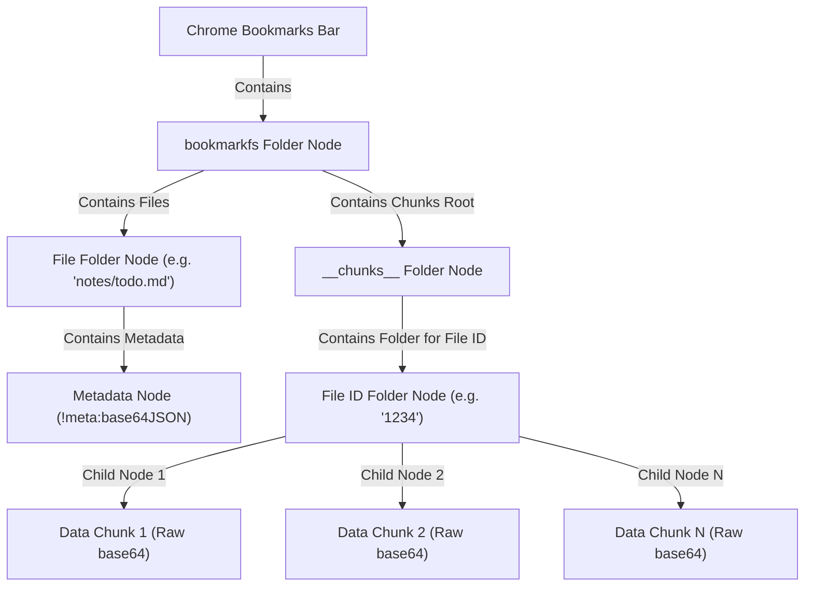

# BookmarkFS 3.0 Technical Documentation 📖🛠️

This document details the architectural design, serialization pipelines, data schemas, logical modules, and rendering engines implemented in BookmarkFS 3.0.

---

## 1. System Architecture

BookmarkFS maps a virtual hierarchical filesystem directly onto Google Chrome's native bookmark tree. Chrome's bookmark sync service distributes this tree across all devices connected to the user's Google account.



### 1.1 Bookmark Tree Mapping & Schema 3
- **Root Directory**: The extension looks for a folder named `bookmarkfs` directly under the Chrome Bookmarks Bar. If it doesn't exist, it creates one.
- **File Folders**: Each virtual file is stored as a bookmark folder node. The `title` of this folder node represents the file path (e.g., `images/vacation/lake.jpg`). Folders have no `url` property.
- **Metadata Node**: Inside the file folder, the file metadata is stored as a child bookmark node. Its `title` is prefixed with `!meta:` followed by a base64-encoded JSON string containing file structure details.
- **Centralized Chunks (`__chunks__/`)**: To prevent Google Chrome from freezing when loading large folder trees, **Schema 3** relocates the actual data chunks from the file folder into a hidden system subfolder `bookmarkfs/__chunks__/<folder_id>/`.
  - **Folder ID mapping**: The title of the chunk folder corresponds to the unique ID of the virtual file's folder node.
  - **Data Chunks**: The bookmark nodes inside this subfolder store raw data payload slices. The `title` of each node contains a base64 chunk string (up to `maxBookmarkSize` characters).
- **Auto-Migration (Schema 2 to Schema 3)**: When a legacy Schema 2 file is read, the system automatically migrates its chunks out of the user-visible virtual directory into the centralized `__chunks__` system directory, deletes the original chunk nodes, and upgrades the metadata schema version in place.

---

## 2. Serialization & Storage Pipeline

### 2.1 The Upload Pipeline (Write)
```
[File/Blob] 
   │
   ▼
[DataURL] ──► Extract Base64 ──► [Original Bytes]
                                        │
                                        ▼ (Optional Gzip)
                                 [Compressed Bytes]
                                        │
                                        ▼ (Optional AES-GCM Encryption)
                                 [Encrypted Bytes]
                                        │
                                        ▼ (Prefix Tag: 'c' or 'r')
                                 [Tagged Payload] ──► Base64 Encode
                                                             │
                                                             ▼
                                                    [Split into Chunks] ──► Write to __chunks__/<file_id>/
```

1.  **Read File**: Read the file as a DataURL via `FileReader`.
2.  **Extract Data**: Parse the DataURL into MIME type metadata and a base64 payload, which is decoded into raw bytes.
3.  **Compress**: Compress the raw bytes using Gzip via `fflate`. If the compressed size is larger than the original, fallback to the uncompressed bytes.
4.  **Encrypt**: If a passphrase is provided, encrypt the bytes using 256-bit AES-GCM.
5.  **Tag & Encode**:
    *   Prepend a tag character: `c` if compressed, `r` if raw.
    *   Base64-encode the resulting byte array.
6.  **Create Metadata**: Build the JSON metadata manifest (Schema Version 3) including:
    *   Original file name and MIME type.
    *   File size metrics (original size vs. total stored size).
    *   Encryption salts, IVs, and state.
    *   A list of SHA-256 hashes for each individual data chunk.
    *   A SHA-256 hash of the entire uncompressed file.
    *   File tags.
7.  **Write Metadata**: Write the metadata node into the file folder.
8.  **Write Data Chunks**: Write the chunks sequentially into bookmark titles within the centralized chunks folder `bookmarkfs/__chunks__/<folder_id>/`.

---

## 3. Logical Components

### 3.1 Custom Encryption & Password Dialog Modal
Replaces legacy browser prompt interfaces with a premium modal featuring:
- **View/Hide Toggle**: Interactive button to toggle input between password mask and raw text characters.
- **Strength Meter**: Real-time password strength meter parsing lengths, digit tests, capital letter tests, and special symbols into color-coded progress feedback (Weak, Medium, Strong).
- **Cryptographic Generator**: Employs browser `crypto.getRandomValues` to generate secure 16-character passwords and automatically copies them to the system clipboard.
- **Session Cache**: Passphrases can be stored in memory (`cachedSessionPassphrase`) to prevent repetitive password requests in the same session.

### 3.2 In-Browser Text & Markdown Editor
Text-based files can be edited directly inside the modal interface:
- **Togglable Edit Mode**: Replaces the preview panel with a fully functional `<textarea>` containing the raw file text.
- **Tag Manager**: Includes an input field to update file tags dynamically on the fly.
- **Direct Save**: Re-encodes, compresses, encrypts (if applicable), splits, and overwrites the chunks directly inside the Chrome bookmark nodes.

### 3.3 Voice Note Recorder
Capture audio files directly in-browser using standard Media API interfaces:
- **MediaRecorder integration**: Captures audio feeds from microphones, encoding them into compressed WebM/OGG files.
- **Live Counter**: Renders dynamic feedback of the current note length during recording.
- **Instant Save**: Prompts for file name and writes the resulting voice note into bookmark nodes.

### 3.4 Bulk Operations Engine
Users can multi-select files/folders to trigger bulk operations:
- **Download as ZIP**: Compresses multiple files in-memory using `fflate.zipSync()` and downloads them as a compiled ZIP archive.
- **Bulk Delete**: Removes multiple folders and their corresponding centralized chunks.
- **Bulk Move**: Updates virtual folders of multiple items simultaneously.

### 3.5 Graphical Storage Category Analyzer
A color-coded visual indicator displaying storage distribution:
- Group files into primary buckets: Images, Audio, Video, Docs, Archives, Code, and Other.
- Generates a responsive horizontal segmented bar chart displaying size percentages for each category.

### 3.6 Single-File Sharing
Exports and imports individual files as Base64 strings:
- **Share**: Bundles metadata, file name, and serialized chunks into a single JSON packet, base64 encodes it, and copies it to clipboard.
- **Import**: Parses the Base64 share packet, automatically handles duplicate name collisions, and writes it directly to the bookmarks tree.

---

## 4. Development & Build Specifications

### 4.1 Webpack Compilation
The webpack script compiles ES6 modules into a single production bundle:
- Uses `CopyPlugin` to copy `dist/unrar.wasm` from `node-unrar-js`.
- Run build using: `npm run build`

### 4.2 Unit Testing
Node.js native test suite verifies code integrity:
- Run tests using: `npm run test`
- Validates path normalization, suffix naming increments, payload splitting, and metadata schema migrations.
