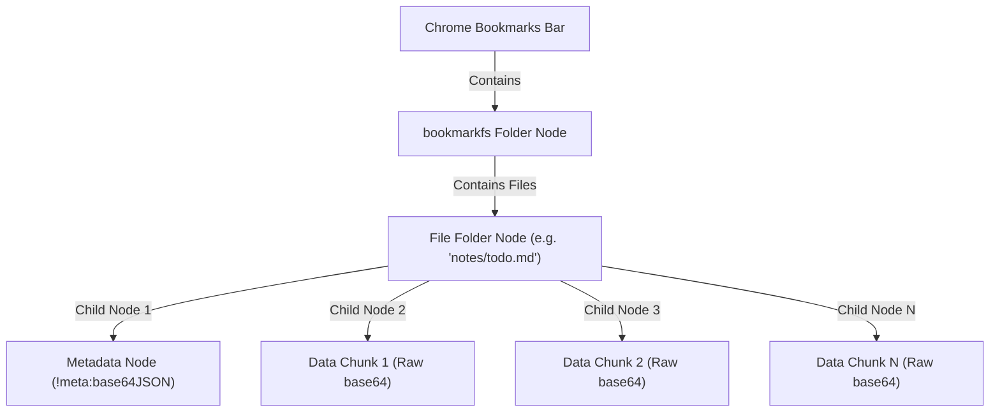

# BookmarkFS 2.0 Technical Documentation 📖🛠️

This document details the architectural design, serialization pipelines, data schemas, logical modules, and rendering engines implemented in BookmarkFS 2.0.

---

## 1. System Architecture

BookmarkFS maps a virtual hierarchical filesystem directly onto Google Chrome's native bookmark tree. Chrome's bookmark sync service distributes this tree across all devices connected to the user's Google account.



### 1.1 Bookmark Tree Mapping
- **Root Directory**: The extension looks for a folder named `bookmarkfs` directly under the Chrome Bookmarks Bar. If it doesn't exist, it creates one.
- **File Folders**: Each virtual file is stored as a bookmark folder node. The `title` of this folder node represents the file path (e.g., `images/vacation/lake.jpg`). Folders have no `url` property.
- **File Nodes**: Inside the file folder, the file contents and metadata are stored as child bookmark nodes.
  - **Metadata Node**: Exactly one child bookmark node represents the file's metadata. Its `title` is prefixed with `!meta:` followed by a base64-encoded JSON string containing file structure details.
  - **Data Chunks**: The remaining child bookmark nodes store raw data payload slices. The `title` of each node contains a base64 chunk string (up to `maxBookmarkSize` characters). Chrome syncs these titles seamlessly.

---

## 2. Serialization & Storage Pipeline

### 2.1 The Upload Pipeline (Write)
```
[File/Blob] 
   │
   ▼
[DataURL] ──► Extract Base64 ──► [Original Bytes]
                                        │
                                        ▼ (Optional Gzip)
                                 [Compressed Bytes]
                                        │
                                        ▼ (Optional AES-GCM Encryption)
                                 [Encrypted Bytes]
                                        │
                                        ▼ (Prefix Tag: 'c' or 'r')
                                 [Tagged Payload] ──► Base64 Encode
                                                             │
                                                             ▼
                                                    [Split into Chunks] ──► Create Bookmarks
```

1.  **Read File**: Read the file as a DataURL via `FileReader`.
2.  **Extract Data**: Parse the DataURL into MIME type metadata and a base64 payload, which is decoded into raw bytes.
3.  **Compress**: Compress the raw bytes using Gzip via `fflate`. If the compressed size is larger than the original, fallback to the uncompressed bytes.
4.  **Encrypt**: If a passphrase is provided, encrypt the bytes using 256-bit AES-GCM.
5.  **Tag & Encode**:
    *   Prepend a tag character: `c` if compressed, `r` if raw.
    *   Base64-encode the resulting byte array.
6.  **Create Metadata**: Build the JSON metadata manifest (Schema Version 2) including:
    *   Original file name and MIME type.
    *   File size metrics (original size vs. total stored size).
    *   Encryption salts, IVs, and state.
    *   A list of SHA-256 hashes for each individual data chunk.
    *   A SHA-256 hash of the entire uncompressed file.
7.  **Write to Chrome Bookmarks**: Write the metadata node first, then write the data chunks sequentially into bookmark titles.

### 2.2 The Download Pipeline (Read)
1.  **Retrieve Nodes**: Fetch all child bookmark nodes inside the file's folder.
2.  **Read Metadata**: Parse the `!meta:` prefixed node, decoding the JSON descriptor.
3.  **Concatenate Chunks**: Combine all non-meta bookmark titles in index order to reconstruct the raw payload string.
4.  **Integrity Validation (Phase 1)**: Verify the SHA-256 hash of each chunk against the array of `chunkHashes` stored in the metadata.
5.  **Decode Base64**: Decode the raw payload string. The first character determines the serialization status (tag `c` vs. `r`).
6.  **Decrypt**: If marked as encrypted, prompt the user for the passphrase (or retrieve the session cache), derive the AES-GCM key, and decrypt using the salt and IV.
7.  **Decompress**: If marked as compressed (tag `c`), decompress using gunzip.
8.  **Integrity Validation (Phase 2)**: Calculate the SHA-256 hash of the reconstructed bytes and verify it matches the `contentHash` in the metadata.
9.  **Serve to Browser**: Sniff the MIME type if missing, wrap the bytes in a Blob, and trigger a browser download or load it into the interactive preview engine.

---

## 3. Logical Components

### 3.1 Encryption & Key Derivation
Encryption uses the browser's native **WebCrypto API**:
- **Key Derivation**: Takes a user password and derives a 256-bit AES key using **PBKDF2** with **SHA-256** and **150,000 iterations**.
- **Cipher**: **AES-GCM** (256-bit). For each encrypted file, the system generates:
  - A cryptographically secure random **16-byte Salt** for PBKDF2.
  - A cryptographically secure random **12-byte IV** for AES-GCM.
- **Passphrase Cache**: Users can opt to cache the passphrase in memory (`cachedSessionPassphrase`) for the duration of the browser tab session to avoid re-typing passwords when downloading or previewing multiple files.

### 3.2 MIME-Type Sniffing
If a file's MIME type is undefined, `sniffMimeFromBytes` inspects byte patterns:
- `image/png`: `89 50 4E 47 0D 0A 1A 0A`
- `image/jpeg`: `FF D8 FF`
- `image/gif`: `47 49 46 38`
- `image/webp`: `52 49 46 46` ... `57 41 56 45`
- `application/pdf`: `25 50 44 46`
- `application/zip`: `50 4B 03 04`
- `application/vnd.rar`: `52 61 72 21 1A 07`
- `application/x-7z-compressed`: `37 7A BC AF 27 1C`
- `application/gzip`: `1F 8B`
- `audio/mpeg` (MP3): `49 44 33` (ID3v2 tag)
- `audio/wav`: `52 49 46 46` ... `57 41 56 45`
- `audio/flac`: `66 4C 61 43`
- If no header signature matches, the function reads a 512-byte sample. If more than 90% of characters are printable ASCII (tabs, linebreaks, standard range), it defaults to `text/plain`; otherwise, it returns `application/octet-stream`.

### 3.3 Drag and Drop URL Fetching
When links or media are dropped from external web pages, the extension uses `chrome.runtime` background context permissions:
1.  **Extract URLs**: Inspects `DataTransfer` formats like `text/uri-list`, `DownloadURL`, or HTML structures to find source URLs.
2.  **Bypass CORS**: Performs a `fetch` request on the dropped resource. The background scope (via `host_permissions: ["<all_urls>"]`) allows loading assets from servers that restrict cross-origin access.
3.  **Detect Filename**: Inspects the `Content-Disposition` header for `filename*=UTF-8''name` or falling back to URL pathname parsing.

---

## 4. Interactive Previews & Rendering Engine

When a user clicks on a file's preview thumbnail, BookmarkFS decodes the file in memory and opens a custom modal containing tailored viewers:

### 4.1 ZIP Archive Explorer
Uses `fflate.unzipSync(bytes)` in-memory:
- Extracts the directory list and file details without writing to disk.
- Renders an interactive table showing internal file paths and decompressed sizes.
- Integrates a **Download** trigger for each row, allowing users to extract and save individual files from the ZIP archive directly.

### 4.2 RAR Archive Explorer
Integrates the WebAssembly build of `node-unrar-js`:
- Loads `dist/unrar.wasm` dynamically via `chrome.runtime.getURL`.
- Initializes the WebAssembly memory extractor with the file bytes.
- Extracts headers and file lists, displaying archive contents in a table.
- Allows users to extract individual files on-demand in-memory and download them.

### 4.3 PDF Document Viewer
- Creates an object URL pointing to a PDF blob.
- Embeds the document in an `<iframe>` within the modal, leveraging Chrome's native PDF renderer to support scrolling, page navigation, zooming, and printing.

### 4.4 Markdown Renderer
Processes text files styled as `.md` through a regex-based parser:
- Escapes raw HTML to prevent XSS.
- Maps markdown syntax into HTML elements:
  - `#` through `######` headings are converted to styled titles.
  - `- list items` are compiled into list containers.
  - Bold (`**`) and italics (`*`) text.
  - Triple backtick code blocks (` ``` `) and inline backticks.
  - Hyperlinks (`[text](url)`) are converted to `target="_blank"` anchors.

### 4.5 Monospace Code Viewer
Displays developer source files inside a dark IDE-styled viewport:
- **Syntax Highlighting**: Renders custom regex styling for JSON key/values, and C-like languages (JS, TS, C++, Go, Rust, Java, Python, HTML/XML, and CSS) using specific keyword, bracket, string, comment, and number colors.
- **Line Numbers**: Adds a side gutter with line numbers. The numbers are styled with `user-select: none` to keep copy-paste actions clean.

---

## 5. Development & Build Specifications

### 5.1 Webpack Compilation
The bundler config (`webpack.config.js`) compiles TypeScript and ES6 modules into a single packed bundle:
```javascript
experiments: {
    asyncWebAssembly: true, // required for WebAssembly imports
    topLevelAwait: true
}
```
The build process uses `CopyPlugin` to copy the precompiled WASM engine from `node_modules/node-unrar-js/dist/js/unrar.wasm` directly into `dist/unrar.wasm` so it can be packaged with the unpacked extension.

### 5.2 Unit Testing
Tests are implemented using Node.js's native test runner (`node --test`).
- **File**: `test/bookmarkfs.test.cjs`
- **Scope**: Verifies helper utilities including path normalization (`normalizeVirtualPath`), file increment versions (`incrementVersionedName`), payload chunking (`splitBySize`), and metadata migration schemas (`migrateMeta`).
